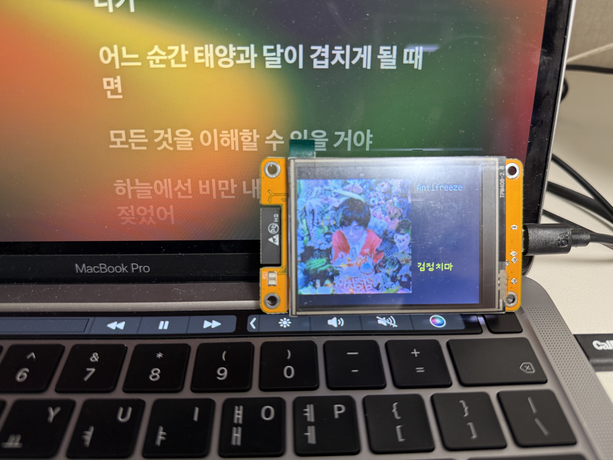

# esp32-music-hub
- ESP32의 Cheap Yellow Display(`esp32-2432s028`)를 활용한 PC 음악 리모트 제어기입니다.
- macOS의 Music.app에서만 작동하며, AppleScript를 통해 재생 정보를 얻습니다.



## 기술 스택
- Python 3 FastAPI
    - macOS의 재생 정보를 네트워크를 통해 전달하기 위해서 사용합니다.
- platformIO (C++)
    - ESP32의 펌웨어를 위해 사용합니다.

## 개발 환경
- macOS Tahoe 26.3 x86
- Visual Studio Code
- Python 3.14.3
- platformIO IDE(Visual Studio Code 확장 프로그램)
- Gemini CLI

## 설치 & 사용하기
> macOS에서 Music.app을 사용할 때만 작동합니다. Spotify와 같은 외부 플레이어에서 작동하지 않습니다.
> `esp32-2432s028`에서만 작동이 확인되었습니다. 다른 파생 보드에서의 작동 여부는 불확실합니다.
> Python3과 platformIO 빌드 도구가 설치되어 있다는 가정 하에 진행합니다.

### 백엔드 설정하기
```bash
# 레포지토리를 클론합니다.
git clone https://github.com/keyfrog-21K/esp32-music-hub
cd esp32-music-hub

# Python venv 가상 환경을 설치합니다.
cd backend
python3 -m venv venv
source venv/bin/activate
pip3 install -r requirements.txt
```

### 펌웨어 환경변수 설정하기
`./firmware/src/` 디렉토리에 `env.h` 파일을 생성하고 아래 코드를 붙여넣습니다:

> Mac의 내부 아이피 주소는 `ipconfig getifaddr en0` 명령어로 확인할 수 있습니다.
```cpp
#pragma once

static const char* ssid = "YOUR_WIFI_SSID"; // 본인의 WIFI SSID를 입력합니다.
static const char* password = "YOUR_WIFI_PASS"; // 본인의 WIFI SSID를 입력합니다.
static const char* serverUrl = "http://mac_ip:8000/nowplaying"; // 본인의 Mac의 IP 주소를 입력합니다. 
```
`firmware` 디렉토리를 platformIO IDE에서 열고 ESP32 보드를 연결해 업로드합니다.

### 실행
`venv`를 활성화한 상태에서 `backend/main.py`를 실행합니다. 실행되어 있는 창을 닫으면 프로그램이 종료되니 창을 닫지 않도록 유의하세요.
